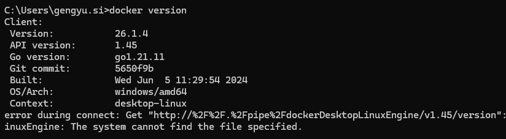

## Docker命令
### 1、帮助命令
```
　　docker version #显示docker的版本信息。
　　docker info #显示docker的系统信息，包括镜像和容器的数量
　　docker --help #帮助命令
    docker-compose version
```



### 2、镜像命令
需要先在windows上打开docker desktop运行docker

```
docker images#查看所有本地主机上的镜像可以使用docker image ls代替
Usage:docker images[OPTIONS][REPOSITORY[:TAG]]
-q#只显示镜像id
-a#列出本地所有镜像（含中间映像层）
--digests#显示镜像的摘要信息
--no-trunc#显示镜像完整信息
[root VM_0_5_centos~]#docker images-a
REPOSITORY TAG IMAGE ID CREATED SIZE
docker.io/hello-world latest bf756fb1ae65 5 months ago 13.3 kB
```
```
　docker search#搜索镜像
　　Usage:docker search[OPTIONS]TERM
　　-f#根据指定条件删选镜像
　　[root VM_0_5_centos~]#docker search mysql-f stars=5000#搜索MySQL镜像stars超过5000的
　　INDEX NAME STARS
　　docker.io docker.io/mysql 9623
```
```
　　docker pull#下载镜像docker image pull
　　Usage:docker pull[OPTIONS]NAME[:TAG|DIGEST]
　　[root VM_0_5_centos~]#docker pull tomcat:8.0#如果不指定tag，默认下载最新版本
　　[root VM_0_5_centos~]#docker images-a
　　REPOSITORY TAG IMAGE ID CREATED SIZE
　　docker.io/tomcat 9.0.36-jdk8-openjdk b79665757bae 4 days ago 530 MB
　　docker.io/tomcat latest 2eb5a120304e 4 days ago 647 MB
　　docker.io/hello-world latest bf756fb1ae65 5 months ago 13.3 kB
　　docker.io/tomcat 8.0 ef6a7c98d192 21 months ago 356 MB
```
```
　　docker rmi#删除镜像docker image rm
　　Usage:docker rmi[OPTIONS]IMAGE[IMAGE...]
　　Remove one or more images
　　Options:
　　-f,--force#强制删除
　　[root VM_0_5_centos~]#docker rmi tomcat#删除最新版本的tomcat
　　[root VM_0_5_centos~]#docker rmi ef6a7c98d192#根据镜像id删除指定的tomcat
　　[root VM_0_5_centos~]#docker rmi-f$
    docker images-aq
    #强制删除全部的镜像
```

### 3、容器命令


```
　　[root VM_0_5_centos~]#docker container--help
　　Usage:docker container COMMAND
　　Manage containers
　　Options:
　　--help Print usage
　　Commands:
　　attach Attach to a running container
　　commit Create a new image from a container's changes
　　cp Copy files/folders between a container and the local filesystem
　　create Create a new container
　　diff Inspect changes on a container's filesystem
　　exec Run a command in a running container
　　export Export a container's filesystem as a tar archive
　　inspect Display detailed information on one or more containers
　　kill Kill one or more running containers
　　logs Fetch the logs of a container
　　ls List containers
　　pause Pause all processes within one or more containers
　　port List port mappings or a specific mapping for the container
　　prune Remove all stopped containers
　　rename Rename a container
　　restart Restart one or more containers
　　rm Remove one or more containers
　　run Run a command in a new container
　　start Start one or more stopped containers
　　stats Display a live stream of containers
    resource usage statistics
　　stop Stop one or more running containers
　　top Display the running processes of a container
　　unpause Unpause all processes within one or more containers
　　update Update configuration of one or more containers
　　wait Block until one or more containers stop,then print their exit codes
　　Run'docker container COMMAND--help'for more information on a command.

```
　启动容器
```
　　docker run镜像id#新建容器并启动
　　Usage:docker run[OPTIONS]IMAGE[COMMAND][ARG...]
　　Options:
　　-d,--detach Run container in background and print
　　-e,--env list Set environment variables
default[]
　　-i,--interactive Keep STDIN open even if not attached
　　-p,--publish list Publish a container's ports to the host
default[]
　　-P,--publish-all Publish all exposed ports to random ports
　　--rm Automatically remove the container when it exits
　　-t,--tty Allocate a pseudo-TTY
　　-v,--volume list Bind mount a volume
default[]
　　--volume-driver string Optional volume driver for the container
　　--volumes-from list Mount volumes from the specified container

default[]
　　[root VM_0_5_centos~]#docker run-it centos/bin/bash#启动centos容器并进入交互
　　[root VM_0_5_centos~]#docker run-d centos#后台启动centos容器，需要注意：docker容器使用后台运行，就必须要有要一个前台进程，docker发现当前容器没有前台进程使用，就会自动停止
```
    进入容器
```
　　docker exec-it容器id bashshell#进入当前正在运行的容器
开启一个新的终端
　　docker attach容器id#进入当前正在运行的容器
直接进入正在运行的终端
```
